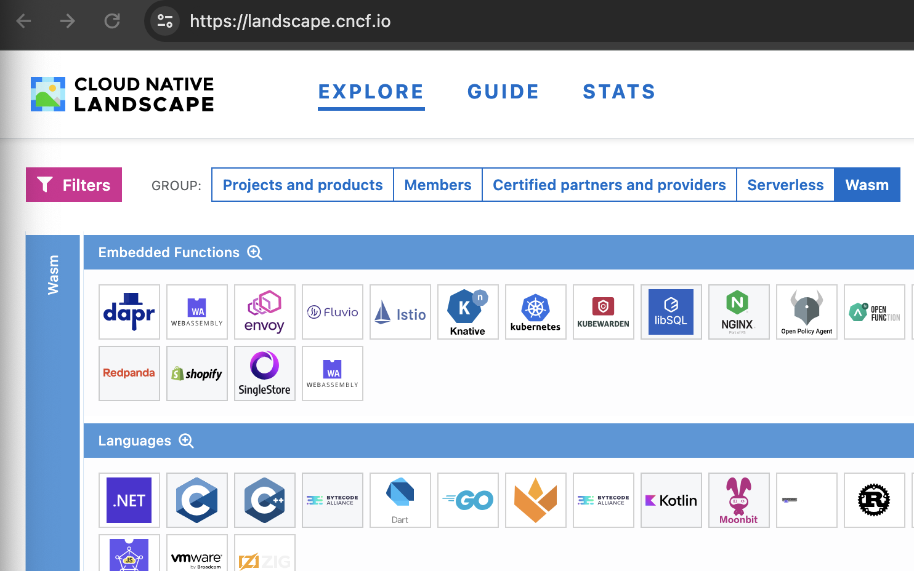

# CNAI Landscape

CNAI landscape generated with [cncf/landscape2](https://github.com/cncf/landscape2).

View here https://rx-m.github.io/cnai-landscape/?group=cnai


# Contribute

To contribute (work only on main branch, do not edit build branch):

* fork
* modify `data.yml` (add / edit) for project entries
* add project logo in the `logos` directory (svg only)
* submit PR

Once accepted (manual at the moment) your changes will go live.


# Next steps

Once we have enough (tbd) we will submit to become group on main landscape (similar to "Wasm").

To view Wasm on main landscape, go here:

https://landscape.cncf.io/

Click "Wasm":



If you want to discuss how its organized or if something should be included / excluded, join the #wg-artificial-intelligence Slack channel on cloud-native.slack.com.

We look forward to your support!

---

# How to build 

* download and install `landscape2` command line tool , refer to https://github.com/cncf/landscape2

* build local landscape with below commands (`build` as output directory)
    ```
    cd cnai-landscape

    landscape2 build \
      --data-file data.yml \
      --settings-file settings.yml \
      --guide-file guide.yml \
      --logos-path logos \
      --output-dir build
    ```

* serve the updated landscape website locally
    ```
    landscape2 serve --landscape-dir build
    ```

* use your browser as prompt, it may be like `http://127.0.0.1:8000/cnai-landscape`


Below are original instructions to help set this up (by Sergio).
>
>- The `main` branch contains the output of the `landscape2 new` command.
>- The `build` branch contains the output of the `landscape2 build` command, which is served by GitHub Pages at <https://rx-m.github.io/cnai-landscape>.
>- The [build workflow](https://github.com/rx-m/cnai-landscape/blob/main/.github/workflows/build.yml) builds the landscape and pushes the result to the `build` branch on every push to the `main` branch.
>
>Also modified in `settings.yml`:
>
>

```
> ...
> 
> # foundation: <FOUNDATION_NAME>
> #
> foundation: CNAI 
> 
> ...
> 
> # base_path: /<BASE_PATH>
> #
> base_path: /cnai-landscape
> 
> ...
> 
```
This is to add the CNAI grouping like Wasm on main landscape.
```
> # groups:
> #   - name: <GROUP_NAME>
> #     categories:
> #       - <CATEGORY1_NAME>
> #       - <CATEGORY2_NAME>
> #
> groups:
>   - name: Some categories
>     categories:
>       - Category 1
>       - Category 2
>   - name: Only category 2
>     categories:
>       - Category 2
>   - name: CNAI
>     categories:
>       - CNAI
>
```
